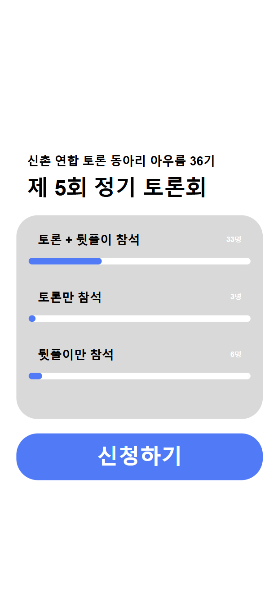

# 신촌연합토론동아리 AURM 토론 신청 웹 폼

## 메인 페이지

2개월간 운영진으로 활동하며, 토론회 신청 현황을 시각적으로 표시하면 참여율이 높아진다는 것을 알게되었습니다. 이를 메인페이지에 반영하였습니다.

## 선택 페이지

### 토론회 참여 여부 선택

선택 창은 로그인 방식 대신, 연동된 구글 시트에서 기수와 이름이 일치하는 사용자를 찾아 시작하도록 하였습니다. 선택 창의 각 항목에는 해당 항목을 선택한 사용자를 표시하여 다른 사용자가 쉽게 확인할 수 있도록 하였습니다. 또한, 메인 페이지와 동일하게 신청 현황을 막대그래프 형태로 시각화하여 표시하였습니다.

### 토론회 참여 입장 선택

토론회 입장 선택 화면에서는 찬성, 반대, 사회자로 참여하는 옵션을 웹 폼에 포함시켜 선택할 수 있도록 하였습니다. 또한, 찬성인지 반대인지 헷갈리는 경우, 간단하고 편리하게 발제문을 다시 확인할 수 있도록 제공하는 위치를 마련하였습니다.

## 완료 페이지

완료 페이지에는 동아리 운영진이 운영하고 있는 인스타그램 계정의 카드뉴스로 이동할 수 있는 버튼을 추가하여, 사용자들이 보다 쉽게 동아리 활동과 관련된 최신 정보를 확인할 수 있도록 하였습니다.

웹 폼을 통해 입력받은 정보는 기존 운영진이 협업에 사용하던 구글 스프레드시트 형식에 자동으로 저장됩니다. 이를 통해 기존 시스템과의 원활한 호환성을 유지하며, 운영진이 이전과 동일한 방식으로 효율적으로 데이터를 관리하고 활용할 수 있습니다.

